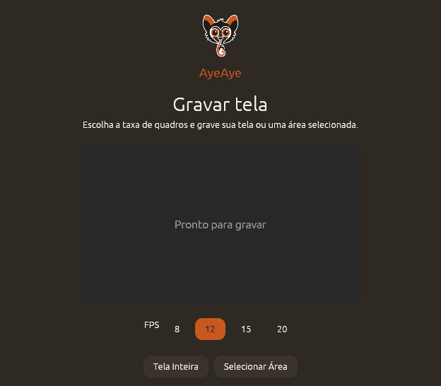
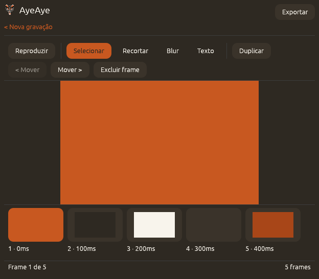

<p align="center">
  
</p>

<h1 align="center">AyeAye</h1>
<p align="center">Screen recorder + GIF editor for Linux (X11), written in Rust.</p>

<p align="center">
  <a href="README.pt-BR.md">Português (Brasil)</a> ·
  <a href="LICENSE"></a>
  
  
</p>

Records a region of the screen, lets you edit the frames (delete, reorder, crop, blur, annotate with text), and exports a GIF. The name is a reference to the aye-aye, a nocturnal lemur from Madagascar.

> [!NOTE]
> Inspired by [ScreenToGif](https://github.com/NickeManarin/ScreenToGif) — this project is an independent rewrite in Rust, focused on Linux/X11, with no affiliation to the original project.

## Screenshots

<p align="center">
  <br/>
  <sub>Record screen — pick the FPS and start a full-screen or area recording.</sub>
</p>
<p align="center">
  <br/>
  <sub>Editor — toolbar with the recording tools above the preview, filmstrip and status bar below.</sub>
</p>

## Requirements

- Linux with an X11 session (run `echo $XDG_SESSION_TYPE` to confirm — it should print `x11`).
- Stable Rust (`rustup show` to check).

## Build

```bash
cargo build --workspace
```

## Run

```bash
cargo run -p app
```

## Usage flow

1. On the "Record screen" screen, choose the FPS (8/12/15/20) and click **Full Screen** or **Select Area**.
   - **Full Screen**: records the monitor where the app window is located.
   - **Select Area**: the screen dims — drag a rectangle over the desired region; recording starts once you release.
2. During recording, a floating indicator shows `REC · MM:SS · N frames`. Click the stop button on the indicator, or press **F9**, at any time.
3. The main window comes back to the foreground with a loading screen ("Processing recording...") while thumbnails are prepared in the background, then shows the editor.
4. In the editor: the toolbar above the preview has the recording tools, the preview sits centered below it, and the filmstrip lists all frames (click to select) above a status bar. Pick a tool from the toolbar:
   - **Select**: Duplicate, move (`<`/`>`), delete the current frame.
   - **Crop**: drag over the preview to crop all frames.
   - **Blur**: adjust intensity, drag over the preview to blur a region across all frames.
   - **Text**: type the text, click the preview to position it across all frames.
   - **Play/Pause** loops the frames in the preview.
5. Click **Export**, choose where to save. The editor remains visible (disabled) with an overlaid progress indicator; it releases automatically and shows "Saved to: ..." when done. "< New recording" discards the current session and returns to the initial screen.

## Scope of this version

See `docs/superpowers/specs/2026-08-12-screentogif-rust-linux-design.md` (original MVP) and `docs/superpowers/specs/2026-08-13-screentogif-capture-editor-redesign-design.md` (current capture and editor flow) for the full design. Out of scope for now: Wayland, webcam, board mode, per-frame delay editing, drag-and-drop reordering in the filmstrip, choosing a specific window to record, export to video/APNG/PSD, save/load project.

## Automated tests

```bash
cargo test --workspace
```

> [!IMPORTANT]
> `capture` and the window/viewport parts of `app` (selection overlay, recording indicator, hiding/focusing the main window) don't have automated tests — they depend on a real X11 display. Use the manual checklist below to verify them; see also `crates/capture/examples/manual_capture.rs`.

<details>
<summary><strong>Manual end-to-end checklist</strong></summary>

- [ ] Full Screen: record, indicator appears and counts correctly, F9 stops it, editor shows the result with the main window in the foreground.
- [ ] Select Area: overlay covers the screen, dragging shows the rectangle in real time, recording starts only in the chosen area.
- [ ] In the editor: exercise Select (duplicate/move/delete), Crop, Blur, Text, and Preview, in that order, on the same recording.
- [ ] Export and open the resulting GIF — confirm it reflects all edits (duplicated frame, crop, blur, text, order).

</details>
